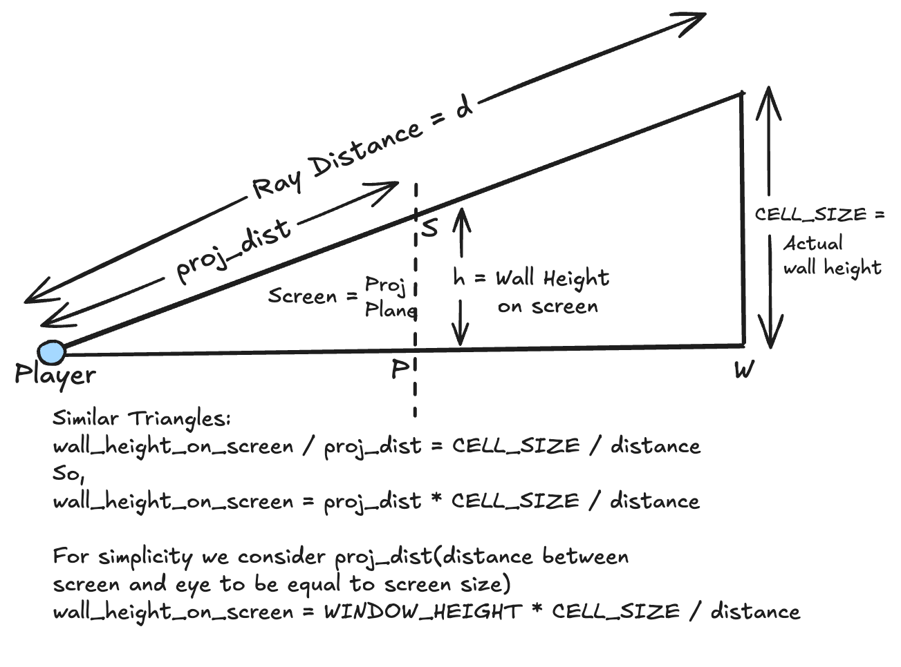
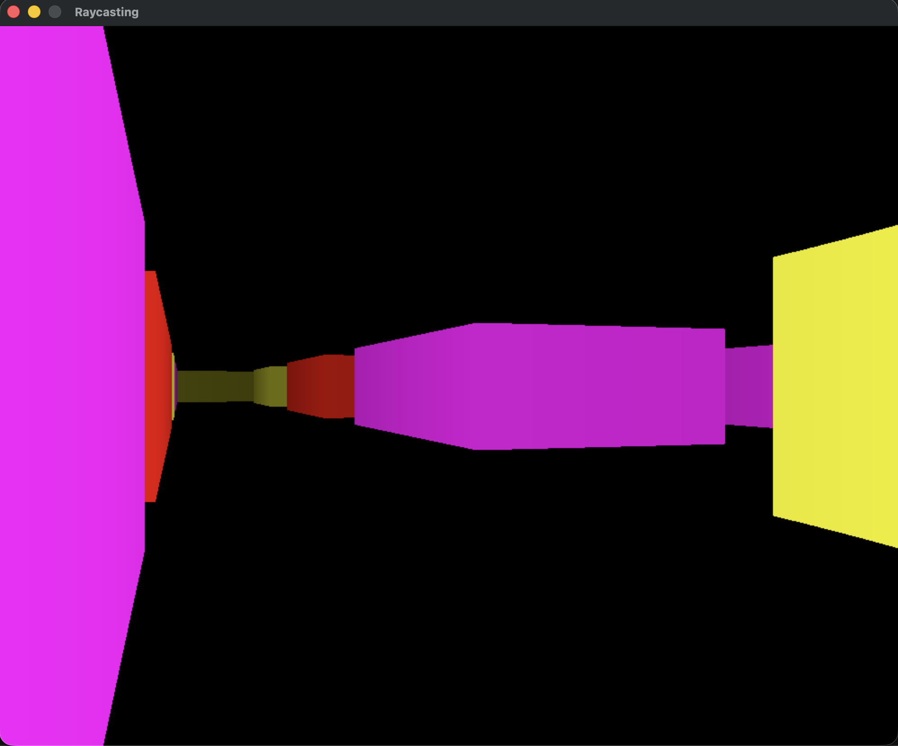
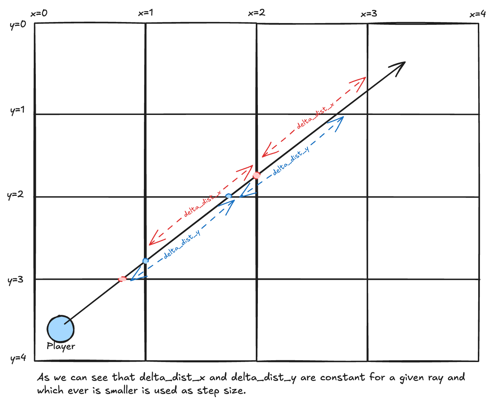
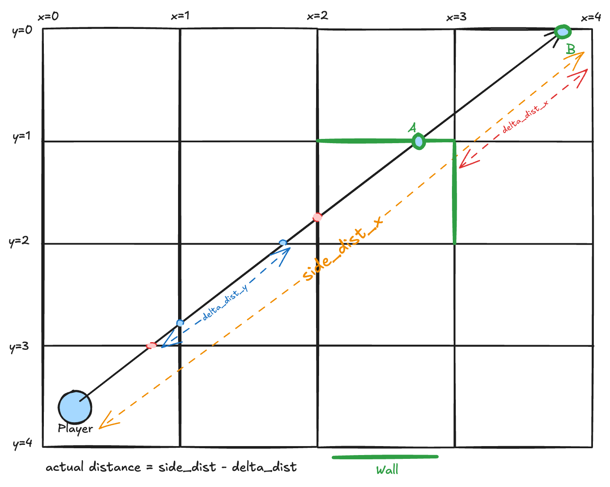
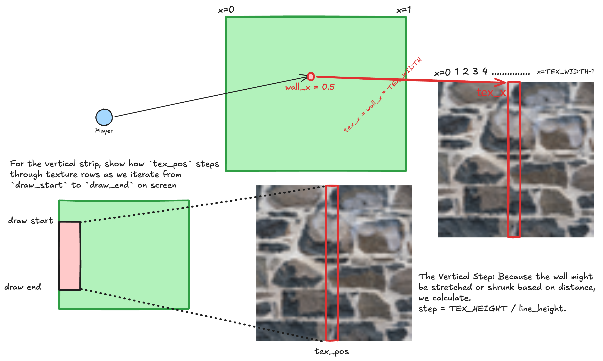
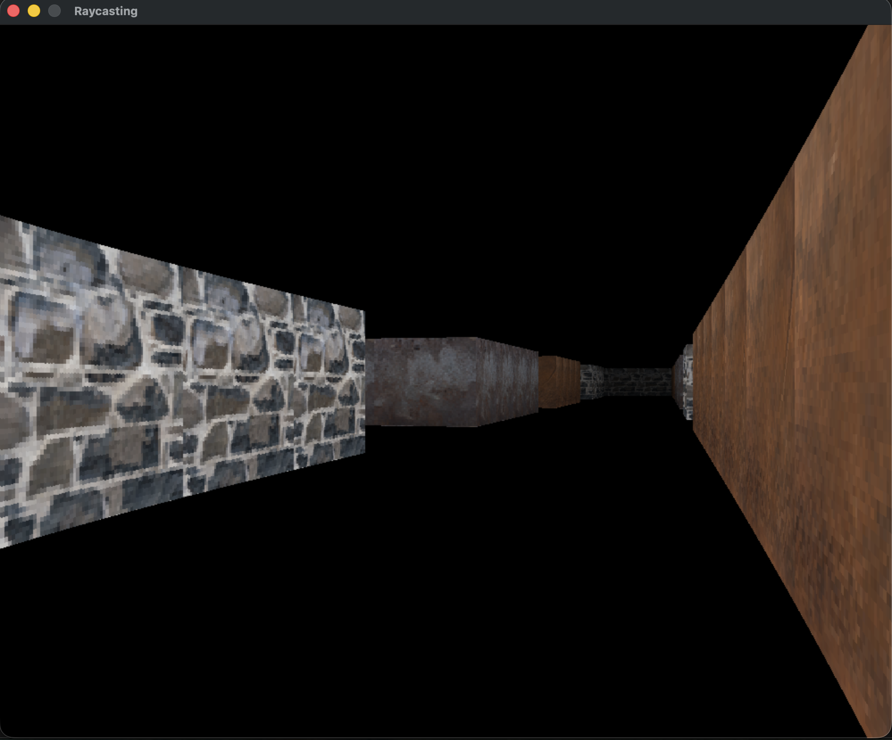
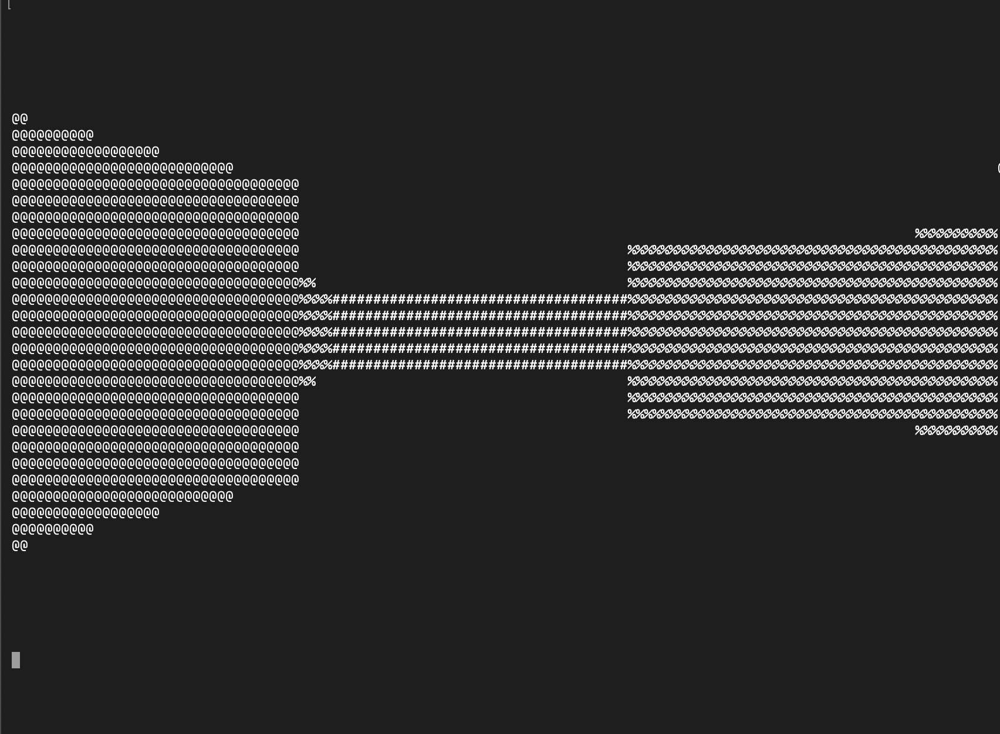

# Raycasting — The Old Trick That Never Gets Old

Every time I implement raycasting I feel the same thing. It's not nostalgia exactly — it's respect. Respect for how elegant the solution is, how something so geometrically simple produces something that *looks* so good. You can go from zero to a first-person 3D world in a couple hundred lines of C, and every step of the way makes sense. That's rare.

I've built this multiple times — naive march, DDA, terminal version. Each time something clicks a little differently. Some connection between the math and the visual output becomes clearer. That's why I keep coming back to it.

So let me walk you through how I did it. From the raw idea to colored walls to textures and even a terminal version. Follow along.

---

## The Core Idea

Before any code, you need to understand what we're actually doing.

You have a 2D map — a grid. Some cells are walls, some are empty. The player stands somewhere in this grid and looks forward. For every vertical strip of pixels on the screen, you shoot a ray from the player's eye in that direction. When the ray hits a wall, you measure how far it traveled. The farther the wall, the shorter the vertical line you draw on screen. Close wall = tall line, far wall = short line. Do this for every column across the screen width — boom, you have a 3D world.

That's the entire illusion.

---

## The Map

The world is a 30×30 integer grid. `0` means empty, anything above `0` is a wall type — different numbers for different colors later.

```c
#define MAP_WIDTH 30
#define MAP_HEIGHT 30
#define CELL_SIZE 64

int world_map[MAP_HEIGHT][MAP_WIDTH] = {
    {1,1,1,1,1,1,1,1,1,1,...},
    {1,0,0,0,0,0,0,0,0,2,...},
    ...
    {1,1,1,1,1,1,1,1,1,1,...}
};
```

Outer border is all `1`s — the boundary. Inside I have rooms and corridors with wall types `1`, `2`, `3`. `CELL_SIZE` of 64 means each cell is 64 units wide in world space. The player's position is measured in those same units, not grid indices.

---

## The Player

Simple struct. Position in world space (floating point) and an angle in degrees.

```c
typedef struct {
    double x, y;
} Vector2D;

typedef struct {
    Vector2D position;
    double angle;
} Player;

Player player = { { 100.0, 100.0 }, 90.0 };
```

Starting at (100, 100) puts us near the top-left corner. Angle 90° is downward in standard math coordinates — that's fine, we handle direction with `cos` and `sin`.

---

## Step 1 — The Naive Ray March

The simplest way to cast a ray: start at the player, walk forward in tiny steps along the ray direction, check every step if you've hit a wall. When you do, return the distance.

```c
#define STEP_SIZE 0.05

RayResult cast_ray(Player *player, double ray_angle) {
    double distance = 0.0;
    RayResult result = {0, 0};

    while (1) {
        double x = player->position.x + distance * cos(ray_angle);
        double y = player->position.y + distance * sin(ray_angle);
        int map_x = (int)(x / CELL_SIZE);
        int map_y = (int)(y / CELL_SIZE);

        if (map_x < 0 || map_x >= MAP_WIDTH || map_y < 0 || map_y >= MAP_HEIGHT)
            break;

        if (world_map[map_y][map_x] > 0) {
            result.distance = distance;
            result.hit_wall = world_map[map_y][map_x];
            return result;
        }

        distance += STEP_SIZE;
        if (distance > 2000) break;
    }

    result.distance = MAX_DISTANCE;
    return result;
}
```

`x = x₀ + t·cos(θ)`, `y = y₀ + t·sin(θ)` — that's a parametric ray equation. You start at the player's position and walk along the ray direction by `t` (the distance). At each step, divide by `CELL_SIZE` to get grid coordinates and check the map.

It works. It's simple to understand. The downside is performance — a step size of `0.05` means thousands of iterations per ray, and we're casting one ray per pixel column. For a 1200px window that's a lot. But for learning — perfect.

---

## The Math Behind the Wall Height

How do we turn a distance into a wall height on screen?



The idea is similar triangles. The real wall is `CELL_SIZE` units tall in the world. The screen is `WINDOW_HEIGHT` pixels tall. The relationship between them depends on how far away the wall is:

```
line_height = (CELL_SIZE * WINDOW_HEIGHT) / corrected_distance
```

Farther away → smaller `line_height`. Closer → taller. The wall strip is then centered vertically on screen:

```c
int draw_start = (WINDOW_HEIGHT / 2) - (line_height / 2);
int draw_end   = (WINDOW_HEIGHT / 2) + (line_height / 2);
```

---

## The Fisheye Fix

Here's a subtle bug you'll hit immediately. If you just use the raw ray distance to calculate wall height, you get a fisheye effect — walls curve at the edges of the screen like a wide-angle lens. Try it once so you see it, then fix it.

The fix is to correct the distance by the cosine of the angle between the ray and the player's forward direction:

```c
double corrected_dist = result.distance * cos(ray_angle - deg_to_rad(player.angle));
int line_height = (int)(CELL_SIZE * WINDOW_HEIGHT / corrected_dist);
```

Without this, you're using the radial ray length — the actual distance from the player's eye to the wall point. With it, you're using the perpendicular distance to the wall plane. The perpendicular distance is what creates a flat, undistorted view.

---

## Drawing the Wall Strips

For each pixel column `i` across the screen, we compute the ray angle, cast the ray, get back a distance and wall type, and draw a vertical line:

```c
for (int i = 0; i < WINDOW_WIDTH; i++) {
    double ray_angle =
        deg_to_rad(player.angle) - deg_to_rad(FOV / 2) +
        ((double)i / (double)WINDOW_WIDTH) * deg_to_rad(FOV);

    RayResult result = cast_ray(&player, ray_angle);
    double corrected_dist = result.distance * cos(ray_angle - deg_to_rad(player.angle));
    int line_height = (int)(CELL_SIZE * WINDOW_HEIGHT / corrected_dist);

    int draw_start = (WINDOW_HEIGHT / 2) - (line_height / 2);
    int draw_end   = (WINDOW_HEIGHT / 2) + (line_height / 2);
    if (draw_start < 0) draw_start = 0;
    if (draw_end >= WINDOW_HEIGHT) draw_end = WINDOW_HEIGHT - 1;

    Uint32 color;
    switch(result.hit_wall) {
        case 1: color = 0xFFFF0000; break; // Red
        case 2: color = 0xFF00FF00; break; // Green
        case 3: color = 0xFF0000FF; break; // Blue
        default: color = 0xFF646464; break; // Gray
    }

    double shading = 1.0 - (corrected_dist / 2000.0);
    draw_line(renderer, i, draw_start, i, draw_end, color, shading);
}
```

FOV is 60 degrees, spread evenly across the screen width. The ray angle for column `i` is linearly interpolated across that range. Center of screen → forward direction. Left edge → `angle - 30°`. Right edge → `angle + 30°`. The shading is simple distance fog — the farther the wall, the dimmer it gets.



At this point you have a functioning 3D raycaster. Colored walls, distance shading, movement. It already feels good.

---

## Step 2 — DDA: The Right Way to Cast Rays

The march-by-tiny-steps approach works but it's brute force. The proper algorithm — the one used in Wolfenstein 3D — is DDA, Digital Differential Analysis. Instead of stepping by a tiny fixed amount, you jump directly from grid line to grid line. You only ever check cells you actually cross into. Exact and fast.

### The Math Behind DDA



The core insight: for any given ray direction, the distance between consecutive vertical grid crossings is always the same. Same for horizontal. So you precompute those intervals (`delta_dist_x`, `delta_dist_y`) and then just keep jumping.

```c
double delta_dist_x = (ray_dir_x == 0) ? 1e30 : fabs(1.0 / ray_dir_x);
double delta_dist_y = (ray_dir_y == 0) ? 1e30 : fabs(1.0 / ray_dir_y);
```

`1 / ray_dir_x` — think about it. If your ray barely moves in x (small `ray_dir_x`), it takes a very long distance to cross a vertical grid line. If your ray is nearly horizontal (large `ray_dir_x`), it crosses vertical lines quickly. The reciprocal captures exactly that.

Then we initialize how far the ray needs to travel to reach the *first* grid line in each direction from the player's current sub-cell position:

```c
if (ray_dir_x < 0) {
    step_x = -1;
    side_dist_x = (pos_x - map_x) * delta_dist_x;
} else {
    step_x = 1;
    side_dist_x = (map_x + 1.0 - pos_x) * delta_dist_x;
}
```

Then the main loop — always step toward whichever grid intersection is closest:

```c
while (1) {
    if (side_dist_x < side_dist_y) {
        side_dist_x += delta_dist_x;
        map_x += step_x;
        result.side = 0; // hit a vertical wall side
    } else {
        side_dist_y += delta_dist_y;
        map_y += step_y;
        result.side = 1; // hit a horizontal wall side
    }

    if (world_map[map_y][map_x] > 0) {
        result.hit_wall = world_map[map_y][map_x];
        break;
    }
}
```

When we hit a wall, `side` tells us whether we came in through a vertical face or a horizontal face. That matters for texturing. The exact distance is then computed from which side we hit:

```c
if (result.side == 0)
    result.distance = (side_dist_x - delta_dist_x) * CELL_SIZE;
else
    result.distance = (side_dist_y - delta_dist_y) * CELL_SIZE;
```

We subtract `delta_dist` because `side_dist_x` already went past the wall when we detected the hit — we want the distance to the wall, not beyond it.



The key advantage over the naive march: no tiny steps, no approximation errors, and we get the exact fractional position along the wall face (`wall_x`). That's what enables texture mapping.

---

## Step 3 — Texture Mapping

This is where it gets satisfying. `wall_x` is the fractional position along the wall face — a value between 0 and 1 representing where horizontally the ray hit the wall. We use it to pick a column from the texture.



Computing `wall_x` from the DDA hit:

```c
double wall_x;
if (result.side == 0)
    wall_x = player->position.y / CELL_SIZE + result.distance / CELL_SIZE * ray_dir_y;
else
    wall_x = player->position.x / CELL_SIZE + result.distance / CELL_SIZE * ray_dir_x;

result.wall_x -= floor(result.wall_x); // keep only the fractional part
```

Then in the rendering loop:

```c
int tex_x = (int)(result.wall_x * (double)TEX_WIDTH);

// flip texture direction based on which side we hit and ray direction
if (result.side == 0 && cos(ray_angle) > 0) tex_x = TEX_WIDTH - tex_x - 1;
if (result.side == 1 && sin(ray_angle) < 0) tex_x = TEX_WIDTH - tex_x - 1;

double step = 1.0 * TEX_HEIGHT / line_height;
double tex_pos = (draw_start - WINDOW_HEIGHT / 2 + line_height / 2) * step;

for (int y = draw_start; y <= draw_end; y++) {
    int tex_y = (int)tex_pos & (TEX_HEIGHT - 1);
    tex_pos += step;

    Uint32 color = texture[tex_x][tex_y];

    Uint8 r = ((color >> 24) & 0xFF) * shading;
    Uint8 g = ((color >> 16) & 0xFF) * shading;
    Uint8 b = ((color >> 8) & 0xFF) * shading;

    SDL_SetRenderDrawColor(renderer, r, g, b, 0xFF);
    SDL_RenderDrawPoint(renderer, i, y);
}
```

The textures are loaded from BMP files into a `Uint32[TEX_WIDTH][TEX_HEIGHT]` array at startup:

```c
SDL_Surface* loadedSurface = SDL_LoadBMP("texture-1.bmp");
SDL_Surface* formattedSurface = SDL_ConvertSurfaceFormat(
    loadedSurface, SDL_PIXELFORMAT_RGBA8888, 0
);

Uint32* pixels = (Uint32*)formattedSurface->pixels;
for (int y = 0; y < TEX_HEIGHT; y++) {
    for (int x = 0; x < TEX_WIDTH; x++) {
        int src_x = (x * width) / TEX_WIDTH;
        int src_y = (y * height) / TEX_HEIGHT;
        texture_1[x][y] = pixels[src_y * width + src_x];
    }
}
```

Different wall types get different textures — `texture_1`, `texture_2`, `texture_3`. The texture flip logic on `tex_x` is easy to miss but important — without it, you get mirrored textures on half the walls depending on which direction you hit them from.



---

## Bonus — Terminal Version

Same algorithm, zero dependencies. Instead of SDL pixels you fill a character buffer. Instead of colors you use ASCII characters to represent shading — from space (far/dark) to `@` (close/bright).

```c
char shades[] = " .:-=+*#%@";

int shade_index = (int)(dist / 2000.0 * 9);
char c = shades[9 - shade_index];

for (int y = start; y <= end; y++) {
    screen[y][x] = c;
}
```

Clear the terminal with ANSI escape `\033[H` and print the buffer each frame. Input is handled with `termios` set to raw non-blocking mode:

```c
new_t.c_lflag &= ~(ICANON | ECHO);
tcsetattr(STDIN_FILENO, TCSANOW, &new_t);

int flags = fcntl(STDIN_FILENO, F_GETFL, 0);
fcntl(STDIN_FILENO, F_SETFL, flags | O_NONBLOCK);
```

`WASD` to move, `q` to quit. A loop sleeps for ~16ms between frames. That's it — a 3D raycaster in 150 lines of pure C with zero dependencies.



---

## Controls

For the SDL version: `W`/`S` to move forward/back, `A`/`D` to strafe. Mouse drag (left button held) rotates the camera. Movement is discrete per keypress — one thing you'd want to improve for a proper game.

The terminal version uses `A`/`D` to rotate left/right instead of strafe, which makes more sense without a mouse.

---

## What You Can Add Next

A few things that take this to the next level:

**Floor and ceiling rendering** — right now above and below is just black. You can use a scanline-based approach that fills floor/ceiling pixels per row rather than per column.

**Sprite rendering** — enemies and items use a separate Z-buffer pass after the walls are drawn. You sort sprites by distance and render them back to front.

**Smooth movement** — track which keys are currently held and apply movement per frame rather than per keypress event.

**Minimap** — draw the 2D grid in a corner of the screen. Great for debugging and actually useful in a game.

**Door cells** — animated cells that open and close. Classic Wolfenstein.

---

## Final Thoughts

Raycasting is one of those algorithms that rewards you immediately. You write 50 lines and you have something visually impressive you can walk around in. You add textures and it looks like an actual game. Every addition has a direct visible payoff.

That's rare. Most things you build don't give you that feedback loop — you work for hours before you see anything meaningful. Raycasting isn't like that. It's responsive. Every line you write changes what you see on screen.

Build it, run it, break it. Double the FOV, invert the shading, set `STEP_SIZE` to 5 and watch the accuracy fall apart. The best way to really understand this is to mess with it.

---

*Built with C and SDL2. Tested on macOS. The terminal version runs anywhere with a POSIX terminal.*